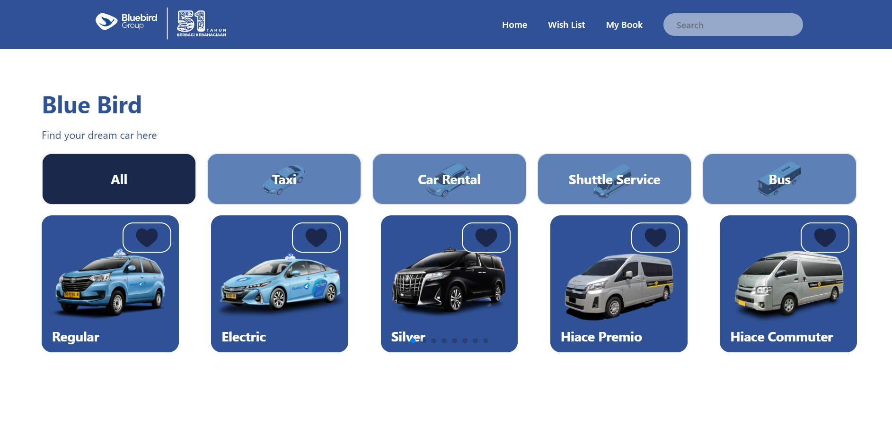

# Blue Bird Frontend Challenge - Aurelius Ivan Wijaya

<!-- Project Description -->
# Project Description
Aplikasi ini merupakan aplikasi yang dibuat untuk memenuhi tugas dari Blue Bird Frontend Challenge. Aplikasi ini dibuat menggunakan ReactJS (dengan Framework Next.JS) dan menggunakan API dari Bluebird.

<!-- Table of Contents -->
# Table of Contents
- [Project Description](#project-description)
- [Table of Contents](#table-of-contents)
- [Getting Started](#getting-started)
    - [Prerequisites](#prerequisites)
    - [Installation](#installation)
- [Usage](#usage)
    - [Home Page](#1-home-page)
    - [Wish List Page](#2-wish-list-page)
    - [My Book Page](#3-my-book-page)

<!-- Home Page -->
## 1. Home Page
Berikut merupakan tampilan dari halaman utama (Home Page) dari aplikasi ini.
 
 

<!-- 
gambar 1.1 Tampilan Home page
 -->
Pada halaman ini penggunakan akan disuguhkan oleh daftar mobil yang tersedia. 

Pada tampilan home, terdapat navbar yang berisi logo dan tombol untuk mengarahkan pengguna ke halaman lainnya.
 
<ul>
    <li>Logo: Mengarahkan pengguna ke halaman utama</li>
    <li>Home: Mengarahkan pengguna ke halaman utama</li>
    <li>Wish List: Mengarahkan pengguna ke halaman Wish List</li>
    <li>My Book: Mengarahkan pengguna ke halaman My Book
    </li>
</ul>