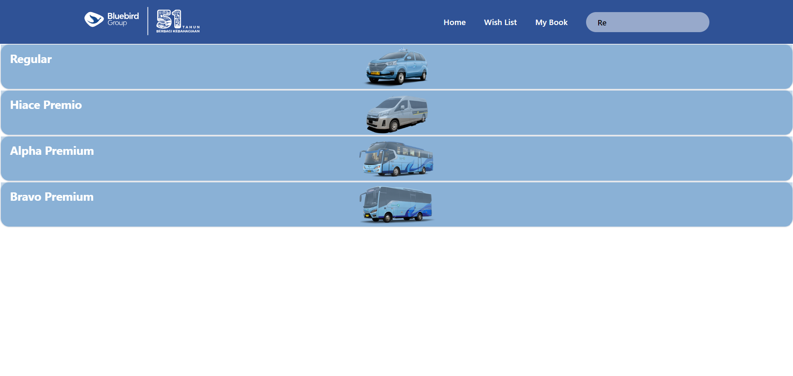
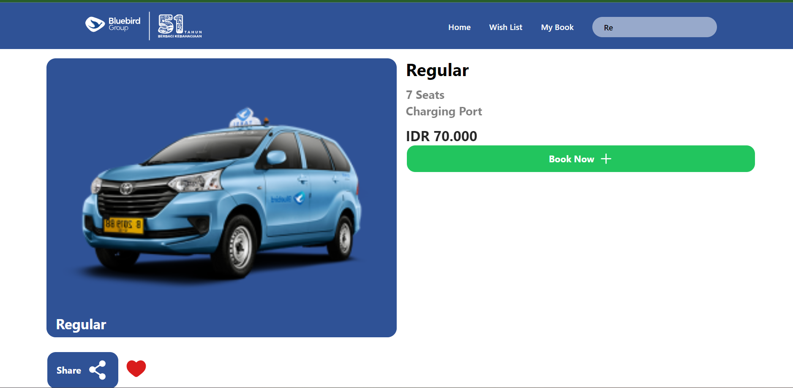
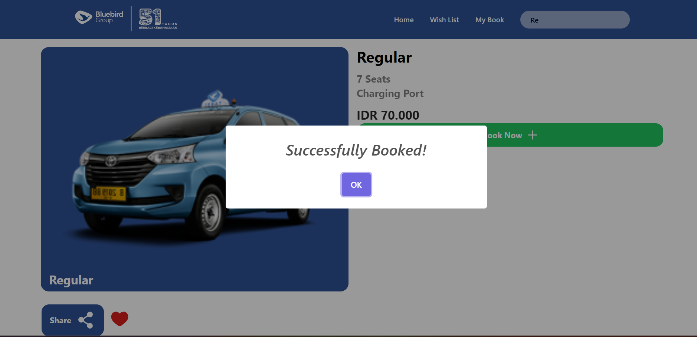
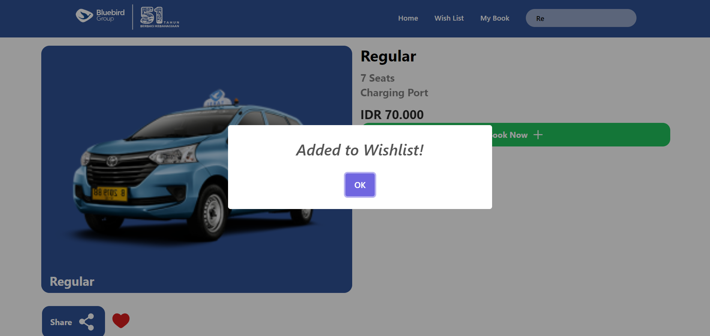
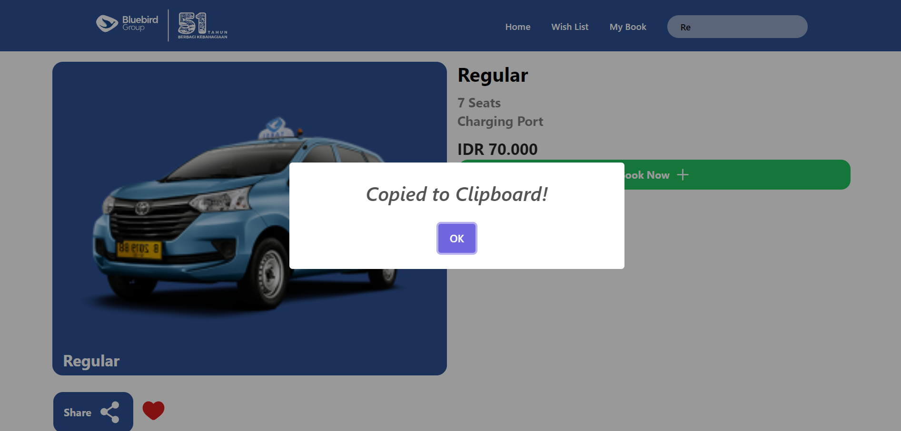
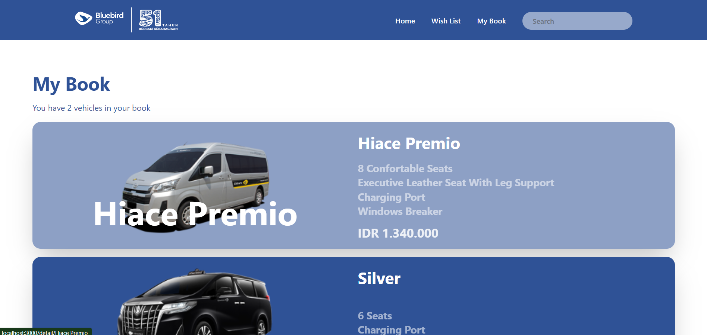
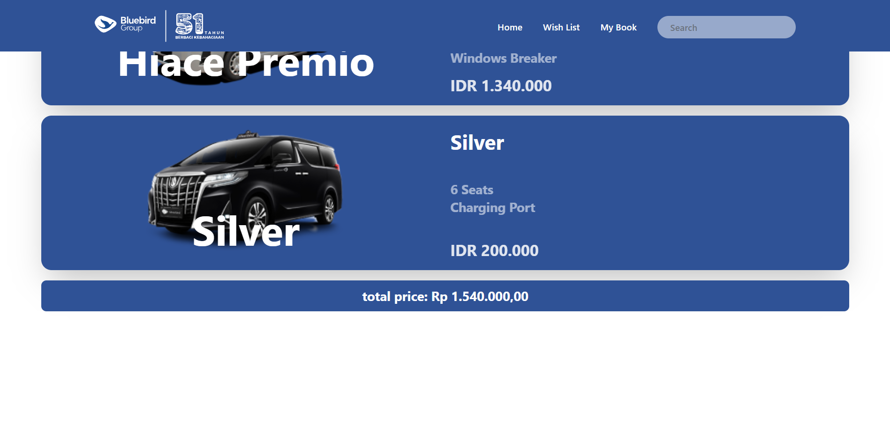
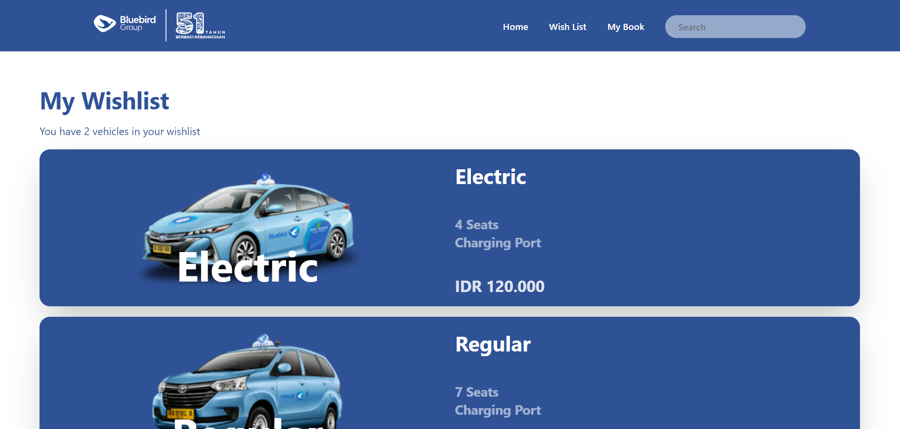

# Blue Bird Frontend Challenge - Aurelius Ivan Wijaya

<!-- Project Description -->
## Project Description
Aplikasi ini merupakan aplikasi yang dibuat untuk memenuhi tugas dari Blue Bird Frontend Challenge. Aplikasi ini dibuat menggunakan ReactJS (dengan Framework Next.JS) dan menggunakan API dari Bluebird.

## Built With
- [ReactJS](https://reactjs.org/)
- [NextJS](https://nextjs.org/)
- [TailwindCSS](https://tailwindcss.com/)
- [Axios](https://axios-http.com/)
- [React-Query](https://react-query.tanstack.com/) (For State Management)
- [SwiperJS](https://swiperjs.com/) (For Carousel)
- [SweetAlert2](https://sweetalert2.github.io/) (For Alert)
- [Jest](https://jestjs.io/) (For Unit Testing)
- [React Testing Library](https://testing-library.com/docs/react-testing-library/intro/) (For Unit Testing)
- [ESLint](https://eslint.org/) (For Linting)

<!-- Table of Contents -->
# Table of Contents
- [Project Description](#project-description)
    - [Built With](#built-with)
- [Table of Contents](#table-of-contents)
- [Getting Started](#getting-started)
    - [Prerequisites](#prerequisites)
    - [Installation](#installation)
- [Usage](#usage)
    - [Home Page](#1-home-page)
    - [Search Page](#2-search-page)
    - [Detail Page](#3-detail-page)
    - [My Book Page](#4-my-book-page)
    - [Wish List Page](#5-wishlist-page)
- [Test Result](#test-result)
- [Contact](#contact)


<!--  Project Description -->
# Getting Started
Berikut merupakan langkah-langkah untuk menjalankan aplikasi ini secara lokal.

## Prerequisites
- NodeJS
- NPM / Yarn (Preferred)

## Installation

1. Clone the repo
```sh
git clone
```
2. Install NPM packages
```sh
npm install
# or
yarn install
```
3. Run the app
```sh
npm run dev
# or 
yarn dev
```

<!-- Usage -->
# Usage
Berikut merupakan tampilan dari aplikasi ini.
<!-- Home Page -->
## 1. Home Page
Berikut merupakan tampilan dari halaman utama (Home Page) dari aplikasi ini.


<!-- <center>gambar 1.1 Tampilan Home page<center> -->

Pada halaman ini penggunakan akan disuguhkan oleh daftar mobil yang tersedia. 


Pada tampilan home, terdapat navbar yang berisi logo dan tombol untuk mengarahkan pengguna ke halaman lainnya.
<br>
<ul>
    <li>Logo: Mengarahkan pengguna ke halaman utama</li>
    <li>Home: Mengarahkan pengguna ke halaman utama</li>
    <li>Wish List: Mengarahkan pengguna ke halaman Wish List</li>
    <li>My Book: Mengarahkan pengguna ke halaman My Book
    </li>
</ul>

## 2. Search Page


Pengguna dapat mengakses halamaan ini, dengan mengetikan kata kuci (keywords) pada search bar yang terdapat pada navbar.
<br>
Ketika Kata kunci sesuai dengan database, maka website akan menampilkan daftar yang sesuai. Pengguna dapat masuk ke halaman detail dengan memilih hasil pencarian. 

## 3. Detail Page 
Berikut merupakan tampilan dari halaman Detail Page dari aplikasi ini. 
<br>

<br>
<br>
Ketika pengguna menekan tombol "Book Now", maka akan muncul pop up "Successfully Booked!" seperti pada gambar berikut ini. Data dari mobil 
yang di book juga kaan disimpan kedalam Book List.
<br>
<br>

Ketika pengguna menekan tombol icon berbentuk Hati, maka akan muncul pop up "Successfully Added to Wish List!" seperti pada gambar berikut ini. Data dari mobil yang dipilih akan disimpan ke daftar Wish List.
<br>
<br>


Ketika pengguna menekan tombol "Share", maka akan muncul pop up "Copied to Clipboard" seperti pada gambar berikut ini. Link dari detail page juga akan tercopy ke clipboard.
<br>
<br>



## 4. My Book Page

Berikut merupakan tampilan dari halaman My Book dari aplikasi ini.





Pada halaman My Book terdapat daftar mobil yang sebelumnya telah di book melalui detail. Pengguna juga dapat melihat total harga dari mobil yang telah di book.

## 5. Wishlist Page 
Berikut merupakan tampilan dari halaman Wish List dari aplikasi ini.



Data yang ada pada halaman ini merupakan data yang telah di tambahkan oleh pengguna melalui detail page dengan mengetuk tombol hati.

# Test Result
Berikut merupakan hasil dari test yang telah dilakukan pada aplikasi ini.


# Contact
Berikut merupakan kontak saya: 
aureliusivanwijaya@gmail.com